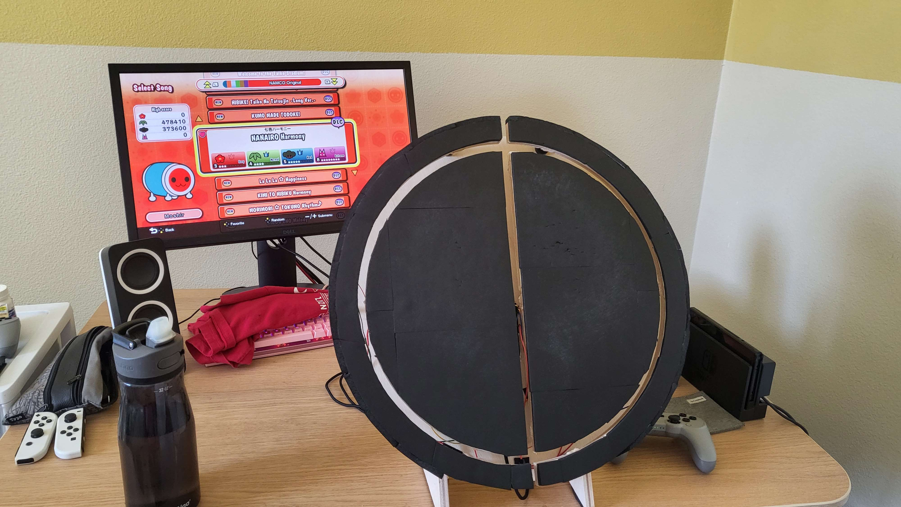
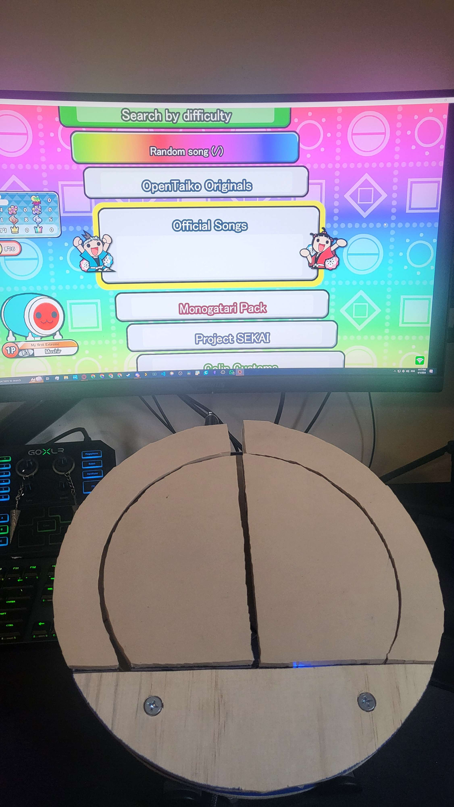

# DIY TaTaCon
Recently I have made a custom DIY TaTaCon, similar to the TaikoForce but at a fraction of the cost (If you're fine with the DIY style lol). 
> Don't expect the same quality as you would from the Taiko Force, but in my opinion, it is an insanely better alternative to the TaTaCons that you find on amazon and of course much cheaper than getting a TaikoForce.
I am hoping to at least document what I've done here, update on future modifications, as well as put down ideas and alternative builds that I come up with.

To begin, please go to [Getting Started](https://github.com/MoshirMoshir/DIY-TaTaCon/wiki/Getting-Started) in this repository's GitHub wiki.

## Showcase
So far I have made two TaTaCons, one big that simulates the TaikoForce and Arcade best, and one small that is more convenient to take around and fit in a backpack or luggage.

### The Big TaTaCon

> Later, I added gum rubber over the black foam, in the future, I would probably just omit the black foam, though it does look cool

### The Small TaTaCon

> The Bottom Panel is blank so I can add a keypad for switch controls later if I want
